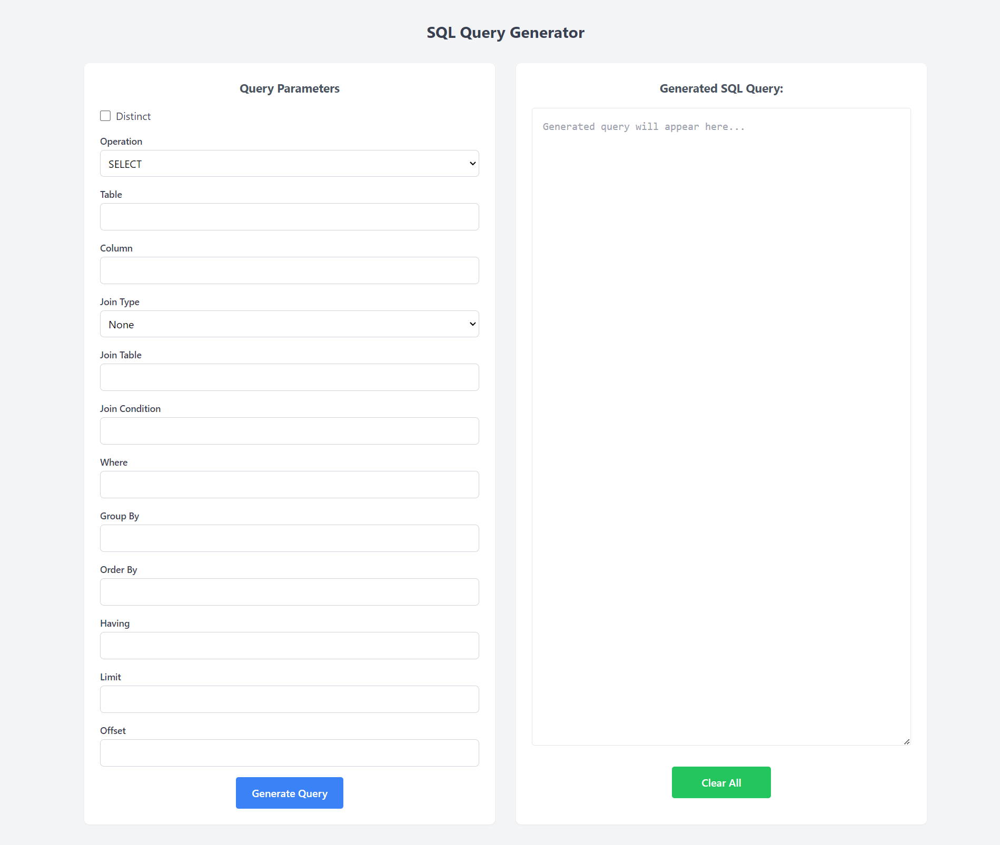

# SQL Query Generator

A standalone HTML app for generating SQL queries based on an intake form.

## Screenshot

## Live App

You can try out the User Data Schema Generator by visiting the [live demo page](https://valiantsin2021.github.io/sql-query-generator/).

## How to Use

1. Open the app via the line above in your browser.
2. Fill out the intake form with your desired query parameters.
3. Click the "Generate Query" button.
4. The generated SQL query will be displayed below the form.
5. "Clear All" button will clear all form inputs and output.

## Features

- Generate SQL queries based on user input.
- Supports multiple database systems (e.g., MySQL, PostgreSQL, SQLite).
- Customizable query templates.

## Contributing

Contributions are welcome! If you find any issues or have suggestions for improvements, please open an issue or submit a pull request.

## License

This project is licensed under the [MIT License](https://opensource.org/licenses/MIT).